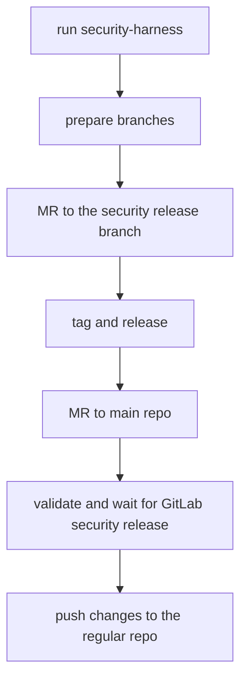

# Security Releases

This guide is based on the main [`gitlab-org/gitlab` security release process](https://gitlab.com/gitlab-org/release/docs/-/tree/master/general/security)

## DO NOT PUSH TO `gitlab-org/editor-extensions/gitlab-eclipse-plugin`

As a developer working on a fix for a security vulnerability, your main concern is not disclosing the vulnerability or the fix before we're ready to publicly disclose it.

To that end, you'll need to be sure that security vulnerabilities are fixed in the [Security Repo](https://gitlab.com/gitlab-org/security/editor-extensions/gitlab-eclipse-plugin).

This is fundamental to our security release process because the [Security Repo](https://gitlab.com/gitlab-org/security/editor-extensions/gitlab-eclipse-plugin) is not publicly-accessible.

## Process

A security fix starts with an issue identifying the vulnerability. In this case, it should be a confidential issue on the `gitlab-org/editor-extensions/gitlab-eclipse-plugin` project on [GitLab.com](https://gitlab.com/)

Once a security issue is assigned to a developer, we follow the same merge request and code review process as any other change, but on the [Security Repo](https://gitlab.com/gitlab-org/security/editor-extensions/gitlab-eclipse-plugin).

### Schema



### Preparation

To contribute a security fix, clone the security repository separately:

```shell
git remote add security git@gitlab.com:gitlab-org/security/editor-extensions/gitlab-eclipse-plugin.git
```

### Request CVE number

For exploitable security issues, request a CVE number by [creating an issue in `gitlab-org/cves` project](https://gitlab.com/gitlab-org/cves/-/issues/new). You can ping the PSIRT team(`@gitlab-com/gl-security/product-security/psirt-group`) to get help filling the details of the CVE. **You can do the release before the CVE number is available.** When the CVE number is assigned, add it to the [changelog entry](https://gitlab.com/gitlab-org/editor-extensions/gitlab-eclipse-plugin/-/blob/main/CHANGELOG.md).

Example CVE request: [https://gitlab.com/gitlab-org/cves/-/issues/21](https://gitlab.com/gitlab-org/cves/-/issues/21)

### Branches

The main objective is to release the security fix as a patch of the latest production release and backporting this fix on `main`.

#### Patch release branch

We release off the main branch. The release can be made from the [Security Repo](https://gitlab.com/gitlab-org/security/editor-extensions/gitlab-eclipse-plugin). See [release process docs](./release_process.md)

#### Security fix branch

Your fix is going to be pushed into `security-<issue number>` branch. If you work on issue #9999, you push the fix into `security-9999` branch.

### Development

Here, the process diverges from the [`gitlab-org/gitlab` security release process](https://gitlab.com/gitlab-org/release/docs/-/tree/master/general/security).

1. Implement the fix and push it to your branch (`security-9999` for issue #9999).
1. Create an MR to merge `security-9999` to the main branch of the [Security Repo](https://gitlab.com/gitlab-org/security/editor-extensions/gitlab-eclipse-plugin) and get it reviewed.
1. Merge the fix (make sure you squash all the MR commits into one).

### Release the change

Follow the [regular release process](./release_process.md) within the security mirror project. It will create tags, do the version bump, and publish the plugin to the Eclipse Marketplace.

Validate that the security issue is fixed in production.

### Patch-release blog post coordination

When releasing a security fix, ping the PSIRT team (`@gitlab-com/gl-security/product-security/psirt-group`) so they can include a note in the next GitLab patch-release blog post (for example: "On YYYY-MM-DD, the GitLab for Eclipse plugin received a fix for CVE-XXXX-XXXX").

### Backport the fix to the extension repository

To backport the fix to the [Eclipse plugin repository](https://gitlab.com/gitlab-org/editor-extensions/gitlab-eclipse-plugin):

1. [Create an MR](https://gitlab.com/gitlab-org/security/editor-extensions/gitlab-eclipse-plugin/-/merge_requests/new?merge_request%5Bsource_project_id%5D=77223497&merge_request%5Bsource_branch%5D=main&merge_request%5Btarget_project_id%5D=62043363&merge_request%5Btarget_branch%5D=main) from the security project:
   - **Source project:** `gitlab-org/security/editor-extensions/gitlab-eclipse-plugin`
   - **Source branch:** `main`
   - **Target project:** `gitlab-org/editor-extensions/gitlab-eclipse-plugin`
   - **Target branch:** `main`

If the project was released via the security mirror, the backport MR should also include the release commit. Ensure that squashing is set to **OFF**. Once merged, a maintainer should push the tag for the release commit.

1. Merge the MR. No review is necessary since the changes have already been
   reviewed.
